<p align="center">
  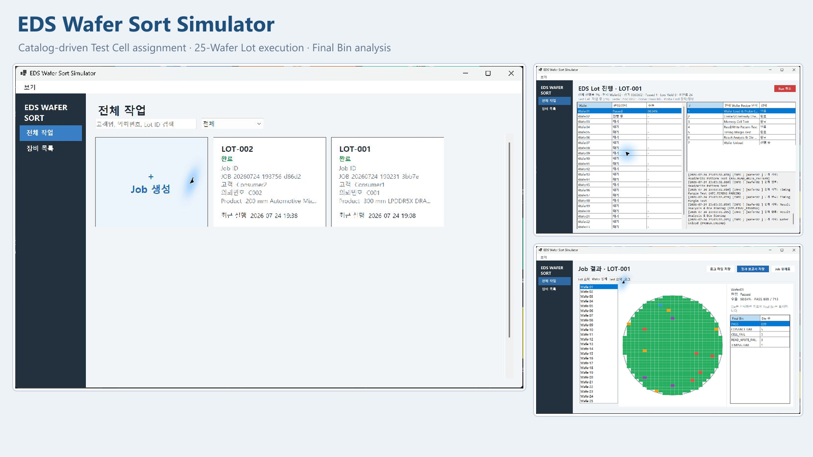
</p>

<h1 align="center">EDS Wafer Sort Simulator</h1>

<p align="center">
  
  
  
  
  <a href="LICENSE"></a>
</p>

<p align="center">
  <a href="README.md">한국어</a> · English · <a href="README.ja.md">日本語</a>
</p>

A semiconductor EDS Wafer Test simulator built with C# WinForms. It models a virtual OSAT Wafer Test workflow that receives Fab-out memory and system semiconductor Wafer Lots, assigns a compatible ATE Wafer Sort Test Cell, and sequentially tests 25 wafers.

## Contents

- [Key Features](#key-features)
- [Quick Start](#quick-start)
- [Usage Example](#usage-example)
- [Output Example](#output-example)
- [Workflow](#workflow)
- [Supported Test Lines](#supported-test-lines)
- [Architecture](#architecture)
- [Simulation Model](#simulation-model)
- [Catalogs](#catalogs)
- [Output Structure](#output-structure)
- [Credits & Disclaimer](#credits--disclaimer)
- [License](#license)

## Key Features

- **Catalog-driven Job creation**: validates Product → Recipe → Test Cell compatibility through JSON catalogs
- **Two EDS Lines**: LPDDR5X Memory Line and Automotive Mixed-Signal MCU Line
- **Sequential 25-Wafer Lot execution**: simulates Wafer01 through Wafer25 across Recipe steps
- **Real-time state synchronization**: updates progress and equipment state on Job cards, Test Cell cards, detail screens, and the progress screen
- **Inspected Die UI**: identifies failed dies at a glance through Wafer and Die views
- **Automatic result reports**: generates a customer-facing PDF with yield and major failure factors, plus an integrated log
- **Final Bin and yield analysis**: aggregates Wafer/Lot yield, Bin distribution, Pareto, and step-level failures
- **Equipment error simulation**: supports Tester, Prober, and Probe Card failures, persistent Cell errors, and manual reset

## Quick Start

### Requirements

- Windows 10 or Windows 11
- [.NET 10 SDK](https://dotnet.microsoft.com/download/dotnet/10.0)
- Optional: Visual Studio with the `.NET desktop development` workload

### Install and Run

```powershell
git clone https://github.com/youn9k/EDS-Wafer-Sort-Simulator.git
cd EDS-Wafer-Sort-Simulator
dotnet restore
dotnet build RecipeTestProject.slnx
dotnet run --project RecipeTestProject.csproj
```

## Usage Example

### 1. Check Test Cell status

Open the equipment list to review connection state, Tester, Prober, and the active Job for each Memory/System IC Line.

<p align="center">
  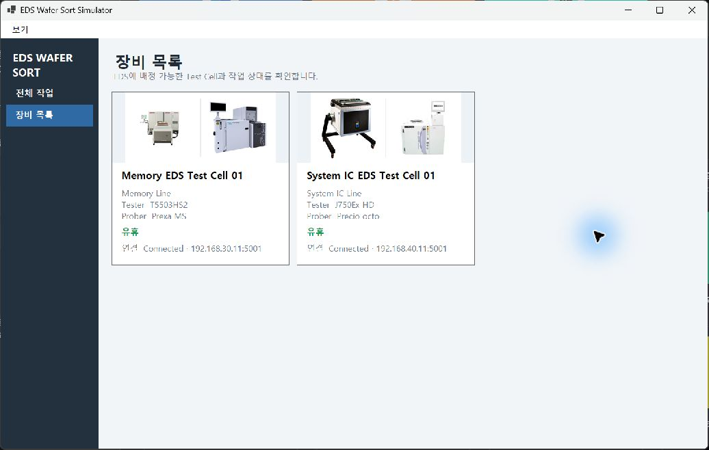
</p>

### 2. Create a Job

Enter the customer, request number, and Lot ID, then select `Product → Recipe → Test Cell`. Incompatible Recipes and Test Cells are filtered automatically.

<p align="center">
  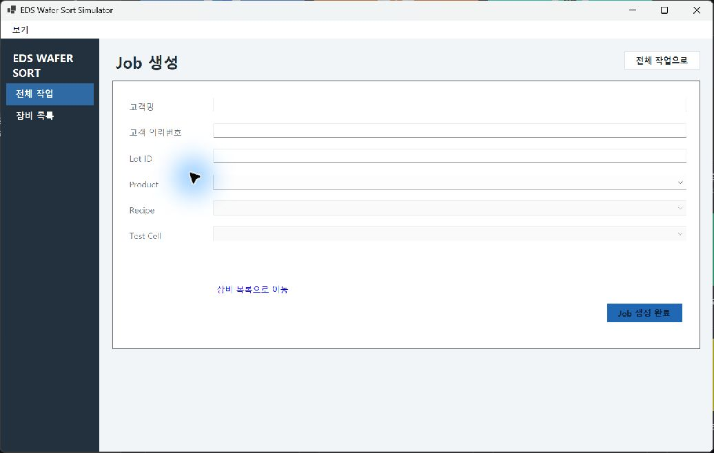
</p>

### 3. Configure simulated EDS results

Set the Lot default target yield and failure Bin distribution. Override the target yield or component error for individual Wafers when needed.

<p align="center">
  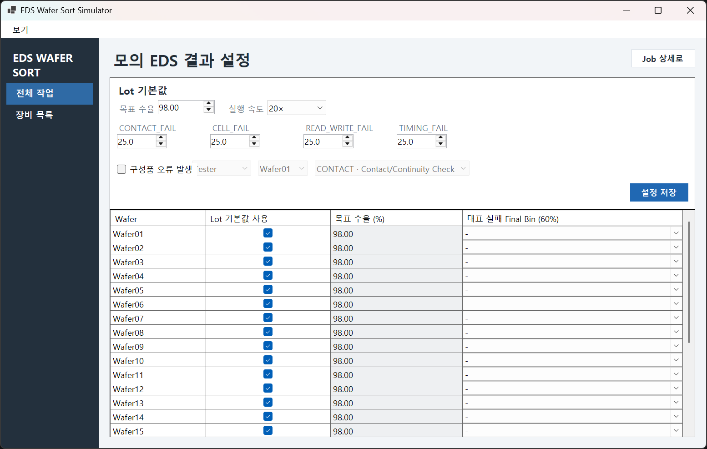
</p>

### 4. Run the 25-Wafer Lot

Execute Wafer01 through Wafer25 in order while monitoring the current Wafer, Recipe step, Cell state, and live log.

<p align="center">
  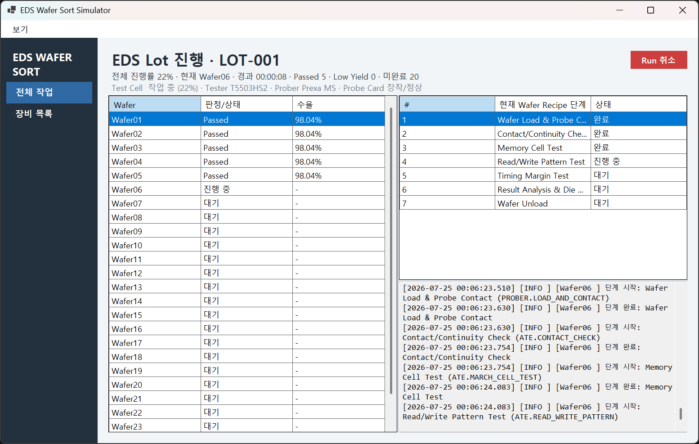
</p>

### 5. Analyze results

Review Lot yield, Final Bin Pareto, and the 25-Wafer table, then inspect failed positions and Bins on each Wafer Die map.

<p align="center">
  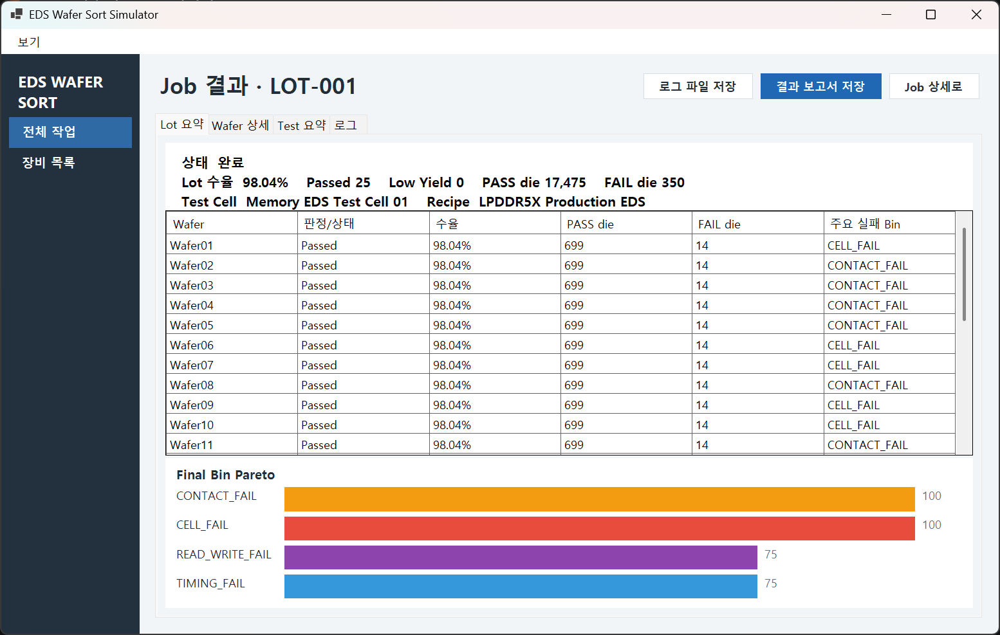
</p>

<p align="center">
  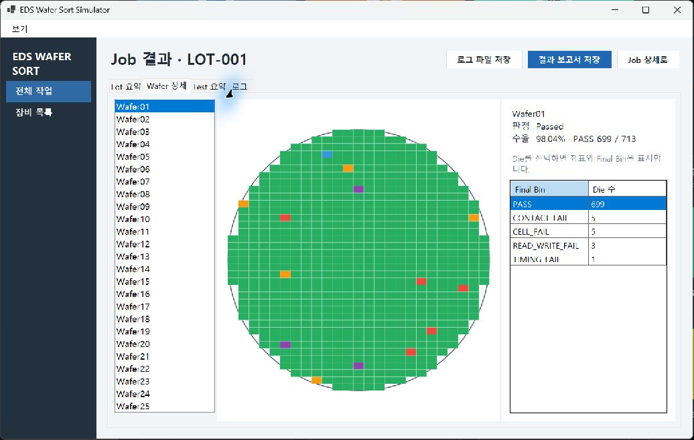
</p>

## Output Example

Each completed Run automatically produces a customer-facing PDF containing customer, Lot, Product, Recipe, Test Cell, Lot/Test summaries, and the 25-Wafer result table. Low Yield Wafers are appended with their Final Bin maps.

### Report summary

<p align="center">
  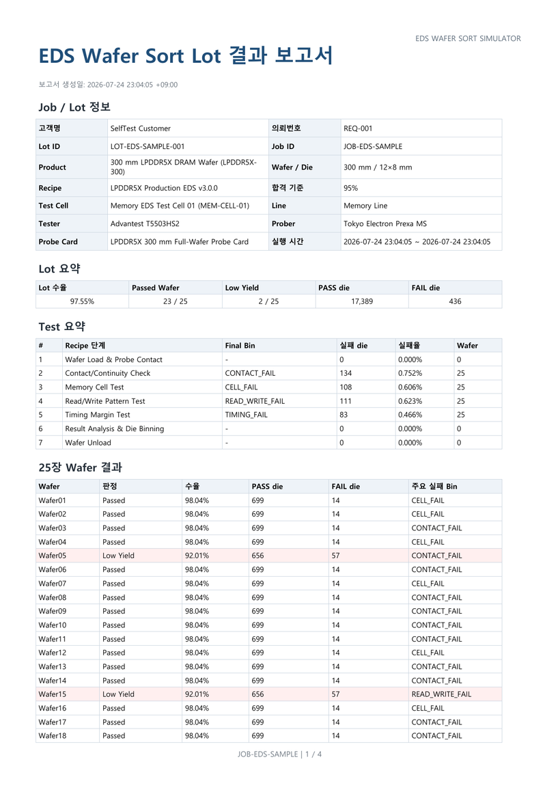
</p>

### Lot and Test summary

<p align="center">
  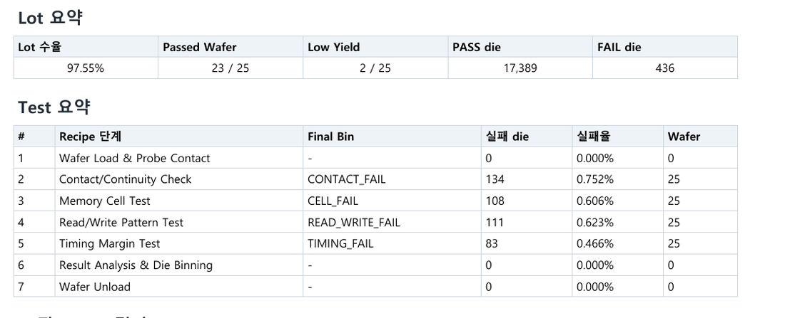
</p>

### Low Yield Wafer appendix

<p align="center">
  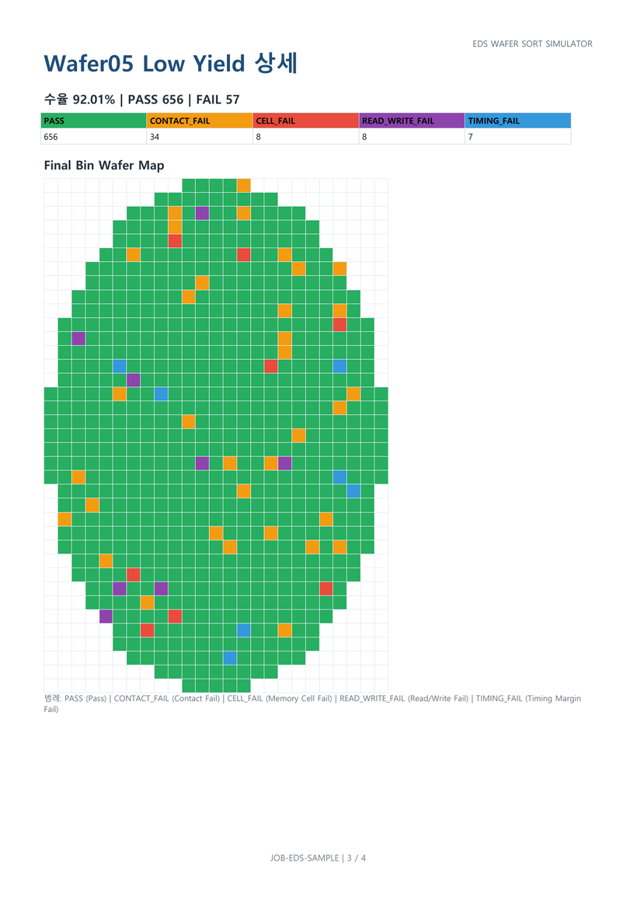
</p>

Automatically saved files for a completed Run:

```text
Results/{JobId}/{RunId}/
├─ run-result.json
├─ run.log
└─ report.pdf
```

## Workflow

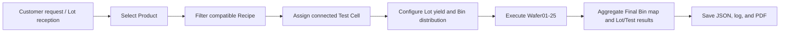

- A Job is the shared execution unit for both Memory and System IC Lines.
- A Test Cell consists of a Tester, Wafer Prober, and fixed Probe Card.
- One Cell can execute only one Run at a time, and queued Jobs do not auto-start.
- Low Yield is a product result, so the next Wafer continues. A Cell error immediately fails the Run.

## Supported Test Lines

| Item | Memory Line | System IC Line |
|---|---|---|
| Product | 300 mm LPDDR5X DRAM Wafer | 200 mm Automotive Mixed-Signal MCU Wafer |
| Tester | Advantest T5503HS2 | Teradyne J750Ex-HD |
| Prober | Tokyo Electron Prexa MS | Tokyo Electron Precio octo |
| Probe Card | LPDDR5X 300 mm Full-Wafer Probe Card | Automotive MCU 200 mm Multi-Site Probe Card |
| Recipe | Load/Contact → Continuity → Memory Cell → Read/Write → Timing Margin → Binning → Unload | Load/Contact → Continuity/DC → Digital/Scan → Embedded Memory → ADC/DAC → Binning → Unload |
| Final Bin | `PASS`, `CONTACT_FAIL`, `CELL_FAIL`, `READ_WRITE_FAIL`, `TIMING_FAIL` | `PASS`, `CONTACT_DC_FAIL`, `DIGITAL_FAIL`, `EMBEDDED_MEMORY_FAIL`, `MIXED_SIGNAL_FAIL` |

## Architecture

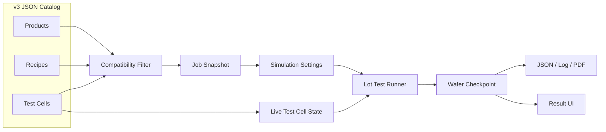

- Product, Recipe, and Test Cell definitions are snapshotted into the Job at creation.
- Live connection, occupancy, and error state is resolved against the current Cell through `TestCellId`.
- The runner reports UI progress through `IProgress<T>` and handles cancellation through `CancellationToken`.

## Simulation Model

- A grid is generated from physical die width and height. A die is valid only when its center lies inside `wafer radius - edge exclusion`.
- The closest integer PASS die count to the target yield is selected.
- Failure positions and Final Bins use a deterministic seed derived from `Run ID + Wafer ID`.
- The default target yield is 98%, and each of the four failure Bins defaults to 25%.
- A Wafer's dominant Bin receives 60% of failed dies; the remainder follows the Lot distribution.
- A Wafer is `Passed` at or above the Product's 95% threshold and `LowYield` below it.
- Lot yield is `total PASS dies / total valid dies` across all 25 completed Wafers.
- Product Final Bins and Cell errors are stored separately.

## Catalogs

### Product

```json
{
  "schemaVersion": "3.0",
  "productId": "LPDDR5X-300",
  "family": "Memory",
  "name": "300 mm LPDDR5X DRAM Wafer",
  "waferDiameterMm": 300,
  "dieWidthMm": 12.0,
  "dieHeightMm": 8.0,
  "edgeExclusionMm": 3.0,
  "acceptanceYieldPercent": 95.0,
  "allowedRecipeIds": ["LPDDR5X-EDS-PROD"]
}
```

### Recipe

```json
{
  "schemaVersion": "3.0",
  "recipeId": "LPDDR5X-EDS-PROD",
  "productFamily": "Memory",
  "compatibleTestCellIds": ["MEM-CELL-01"],
  "requiredCapabilities": ["LPDDR5X", "300mm", "FullWaferContact", "HighSpeedMemory"],
  "finalBins": [
    { "code": "PASS", "isPass": true, "colorHex": "#27AE60" },
    {
      "code": "CELL_FAIL",
      "isPass": false,
      "relatedStepId": "CELL_TEST",
      "colorHex": "#E74C3C"
    }
  ]
}
```

### Test Cell

```json
{
  "schemaVersion": "3.0",
  "id": "MEM-CELL-01",
  "line": "Memory Line",
  "tester": {
    "manufacturer": "Advantest",
    "model": "T5503HS2",
    "imageFile": "images/advantest-t5503hs2.png"
  },
  "prober": {
    "manufacturer": "Tokyo Electron",
    "model": "Prexa MS",
    "imageFile": "images/tel-prexa-ms.jpg"
  },
  "supportedWaferDiametersMm": [300],
  "capabilities": ["LPDDR5X", "300mm", "FullWaferContact", "HighSpeedMemory"]
}
```

## Output Structure

Runtime data is stored under `%LocalAppData%\RecipeTestProject`.

```text
RecipeTestProject/
├─ test-cell-state.json
├─ jobs.json
└─ Results/
   └─ {JobId}/{RunId}/
      ├─ run-result.json
      ├─ run.log
      └─ report.pdf
```

- Job and Run checkpoint JSON is written through a temporary file and then replaced.
- Completed Runs save JSON, log, and PDF.
- Failed, Canceled, and Interrupted Runs preserve partial JSON and logs only.
- Missing or damaged result files do not remove Run history or its stored path.

## Credits & Disclaimer

Product names, trademarks, and images belong to their respective manufacturers. This project is not used commercially.

- [Advantest T5503HS2](https://www.advantest.com/tw/products/semiconductor-test-system/memory/t5503hs2/)
- [Teradyne J750Ex-HD](https://www.teradyne.com/products/j750/?lang=en)
- [Tokyo Electron Prexa MS](https://www.tel.com/product/prexa.html)
- [Tokyo Electron Precio octo](https://www.tel.com/product/precio.html)

## License

The source code is distributed under the [MIT License](LICENSE).

Manufacturer equipment images, product names, and trademarks are not covered by the MIT License and remain the property of their respective owners.
