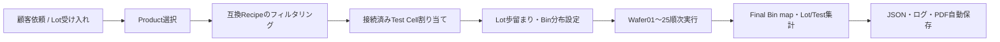
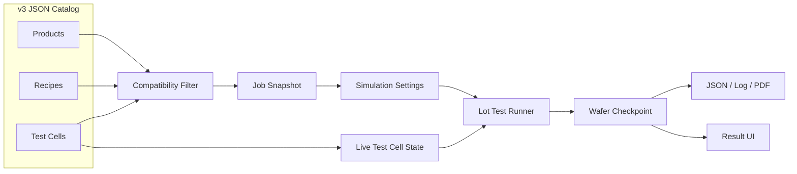

<p align="center">
  
</p>

<h1 align="center">EDS Wafer Sort Simulator</h1>

<p align="center">
  
  
  
  
  <a href="LICENSE"></a>
</p>

<p align="center">
  <a href="README.md">한국어</a> · <a href="README.en.md">English</a> · 日本語
</p>

C# WinFormsで実装した半導体EDS Wafer Testシミュレーターです。Fab-outされたメモリおよびシステム半導体のWafer Lotを受け入れ、製品と互換性のあるATE Wafer Sort Test Cellを割り当て、25枚のWaferを順次テストする仮想OSAT Wafer Testプログラムです。

## 目次

- [Key Features](#key-features)
- [Quick Start](#quick-start)
- [使用例](#使用例)
- [Output Example](#output-example)
- [Workflow](#workflow)
- [Supported Test Lines](#supported-test-lines)
- [Architecture](#architecture)
- [Simulation Model](#simulation-model)
- [Catalogs](#catalogs)
- [Output Structure](#output-structure)
- [Credits & Disclaimer](#credits--disclaimer)
- [License](#license)

## Key Features

- **Catalog-driven Job作成**: JSONカタログによりProduct → Recipe → Test Cellの互換性を検証
- **2種類のEDS Line**: LPDDR5X Memory LineとAutomotive Mixed-Signal MCU Line
- **25-Wafer Lotの順次実行**: Wafer01からWafer25までをRecipeステップごとにシミュレーション
- **リアルタイム状態同期**: Jobカード、Test Cellカード、詳細・進行画面の進捗率と装置状態を更新
- **検査済みDie UI**: WaferおよびDie UIから不良Dieを一目で確認
- **結果レポート自動生成**: 歩留まりと主な失敗要因を含む顧客向けPDFレポート、および統合ログを自動生成
- **Final Binと歩留まり分析**: Wafer/Lot歩留まり、Bin分布、Pareto、ステップ別失敗を集計
- **装置エラーシミュレーション**: Tester・Prober・Probe Cardのエラー、Run失敗、Cellエラー保持、手動リセットに対応

## Quick Start

### 必要環境

- Windows 10またはWindows 11
- [.NET 10 SDK](https://dotnet.microsoft.com/download/dotnet/10.0)
- 任意: Visual Studioの`.NET デスクトップ開発`ワークロード

### インストールと実行

```powershell
git clone https://github.com/youn9k/EDS-Wafer-Sort-Simulator.git
cd EDS-Wafer-Sort-Simulator
dotnet restore
dotnet build RecipeTestProject.slnx
dotnet run --project RecipeTestProject.csproj
```

## 使用例

### 1. Test Cellの状態を確認

装置一覧でMemory/System IC Lineの接続状態、Tester、Prober、および現在のJobを確認します。

<p align="center">
  
</p>

### 2. Jobを作成

顧客名、依頼番号、Lot IDを入力し、`Product → Recipe → Test Cell`の順に選択します。互換性のないRecipeとTest Cellは自動的に除外されます。

<p align="center">
  
</p>

### 3. 模擬EDS結果を設定

Lotの基本目標歩留まりと失敗Bin分布を設定し、必要に応じてWafer別の目標歩留まりまたは構成部品エラーを上書きします。

<p align="center">
  
</p>

### 4. 25-Wafer Lotを実行

Wafer01からWafer25まで順次実行し、現在のWafer、Recipeステップ、Cell状態、リアルタイムログを確認します。

<p align="center">
  
</p>

### 5. 結果を分析

Lot歩留まり、Final Bin Pareto、25枚の結果表を確認し、Wafer別Die mapで不良位置とBinを分析します。

<p align="center">
  
</p>

<p align="center">
  
</p>

## Output Example

完了したRunでは、顧客・Lot・Product・Recipe・Test Cell情報、Lot/Testサマリー、25枚の結果表を含む顧客向けPDFレポートを自動生成します。Low Yield Waferがある場合は、そのFinal Bin mapを付録に追加します。

### レポートサマリー

<p align="center">
  
</p>

### LotおよびTestサマリー

<p align="center">
  
</p>

### Low Yield Wafer付録

<p align="center">
  
</p>

完了Runで自動保存されるファイル:

```text
Results/{JobId}/{RunId}/
├─ run-result.json
├─ run.log
└─ report.pdf
```

## Workflow



- JobはMemoryとSystem IC Lineを共通に表現する実行単位です。
- Test CellはTester、Wafer Prober、固定Probe Cardで構成されます。
- 1台のCellでは同時に1つのRunだけを実行でき、待機Jobは自動起動しません。
- Low Yieldは製品検査結果であるため次のWaferへ進み、CellエラーはRunを即時失敗にします。

## Supported Test Lines

| 項目 | Memory Line | System IC Line |
|---|---|---|
| Product | 300 mm LPDDR5X DRAM Wafer | 200 mm Automotive Mixed-Signal MCU Wafer |
| Tester | Advantest T5503HS2 | Teradyne J750Ex-HD |
| Prober | Tokyo Electron Prexa MS | Tokyo Electron Precio octo |
| Probe Card | LPDDR5X 300 mm Full-Wafer Probe Card | Automotive MCU 200 mm Multi-Site Probe Card |
| Recipe | Load/Contact → Continuity → Memory Cell → Read/Write → Timing Margin → Binning → Unload | Load/Contact → Continuity/DC → Digital/Scan → Embedded Memory → ADC/DAC → Binning → Unload |
| Final Bin | `PASS`, `CONTACT_FAIL`, `CELL_FAIL`, `READ_WRITE_FAIL`, `TIMING_FAIL` | `PASS`, `CONTACT_DC_FAIL`, `DIGITAL_FAIL`, `EMBEDDED_MEMORY_FAIL`, `MIXED_SIGNAL_FAIL` |

## Architecture



- 作成時にProduct・Recipe・Test CellをJobへスナップショット保存します。
- リアルタイムの接続・占有・エラー状態は`TestCellId`で現在のCellと関連付けます。
- 実行エンジンは`IProgress<T>`でUIへ進行状況を通知し、`CancellationToken`でキャンセルを処理します。

## Simulation Model

- 実際のdie幅・高さからグリッドを生成し、die中心が`wafer radius - edge exclusion`内にある場合のみ有効dieとして使用します。
- 目標歩留まりに最も近い整数のPASS die数を選択します。
- `Run ID + Wafer ID`による決定的seedで失敗die位置とFinal Binを生成します。
- 基本目標歩留まりは98%、4つの失敗Binの基本分布は各25%です。
- Waferの代表Binに失敗dieの60%を割り当て、残りはLot分布に従います。
- Wafer歩留まりがProduct基準の95%以上なら`Passed`、未満なら`LowYield`です。
- Lot歩留まりは完了した25枚全体の`PASS die合計 / 有効die合計`です。
- 製品Final BinとCellエラーは分離して保存します。

## Catalogs

### Product

```json
{
  "schemaVersion": "3.0",
  "productId": "LPDDR5X-300",
  "family": "Memory",
  "name": "300 mm LPDDR5X DRAM Wafer",
  "waferDiameterMm": 300,
  "dieWidthMm": 12.0,
  "dieHeightMm": 8.0,
  "edgeExclusionMm": 3.0,
  "acceptanceYieldPercent": 95.0,
  "allowedRecipeIds": ["LPDDR5X-EDS-PROD"]
}
```

### Recipe

```json
{
  "schemaVersion": "3.0",
  "recipeId": "LPDDR5X-EDS-PROD",
  "productFamily": "Memory",
  "compatibleTestCellIds": ["MEM-CELL-01"],
  "requiredCapabilities": ["LPDDR5X", "300mm", "FullWaferContact", "HighSpeedMemory"],
  "finalBins": [
    { "code": "PASS", "isPass": true, "colorHex": "#27AE60" },
    {
      "code": "CELL_FAIL",
      "isPass": false,
      "relatedStepId": "CELL_TEST",
      "colorHex": "#E74C3C"
    }
  ]
}
```

### Test Cell

```json
{
  "schemaVersion": "3.0",
  "id": "MEM-CELL-01",
  "line": "Memory Line",
  "tester": {
    "manufacturer": "Advantest",
    "model": "T5503HS2",
    "imageFile": "images/advantest-t5503hs2.png"
  },
  "prober": {
    "manufacturer": "Tokyo Electron",
    "model": "Prexa MS",
    "imageFile": "images/tel-prexa-ms.jpg"
  },
  "supportedWaferDiametersMm": [300],
  "capabilities": ["LPDDR5X", "300mm", "FullWaferContact", "HighSpeedMemory"]
}
```

## Output Structure

実行データは`%LocalAppData%\RecipeTestProject`に保存されます。

```text
RecipeTestProject/
├─ test-cell-state.json
├─ jobs.json
└─ Results/
   └─ {JobId}/{RunId}/
      ├─ run-result.json
      ├─ run.log
      └─ report.pdf
```

- JobとRunのチェックポイントJSONは一時ファイルへ書き込んだ後に置換します。
- Completed RunではJSON・ログ・PDFを保存します。
- Failed/Canceled/Interrupted Runでは部分JSONとログのみ保持します。
- 結果ファイルが欠落または破損してもRun履歴と保存パスは維持します。

## Credits & Disclaimer

製品名、商標、写真の権利は各メーカーに帰属し、本プロジェクトは商用利用していません。

- [Advantest T5503HS2](https://www.advantest.com/tw/products/semiconductor-test-system/memory/t5503hs2/)
- [Teradyne J750Ex-HD](https://www.teradyne.com/products/j750/?lang=en)
- [Tokyo Electron Prexa MS](https://www.tel.com/product/prexa.html)
- [Tokyo Electron Precio octo](https://www.tel.com/product/precio.html)

## License

ソースコードは[MIT License](LICENSE)で配布されます。

メーカーの装置写真、製品名、商標はMIT Licenseの対象外であり、それぞれの権利者に帰属します。
