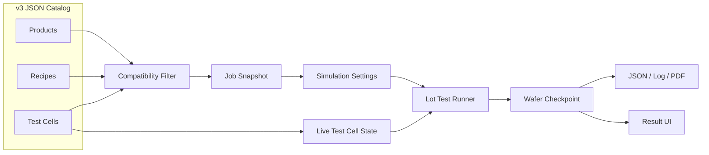

<p align="center">
  
</p>

<h1 align="center">EDS Wafer Sort Simulator</h1>

<p align="center">
  
  
  
  
  <a href="LICENSE"></a>
</p>

<p align="center">
  한국어 · <a href="README.en.md">English</a> · <a href="README.ja.md">日本語</a>
</p>

C# WinForms로 구현한 반도체 EDS Wafer Test 시뮬레이터입니다. Fab-out된 메모리 및 시스템 반도체 웨이퍼 Lot을 인수해, 제품과 호환되는 ATE Wafer Sort Test Cell을 배정하고 25장의 웨이퍼를 순차 테스트하는 가상의 OSAT Wafer Test 프로그램입니다.

## 목차

- [Key Features](#key-features)
- [Quick Start](#quick-start)
- [사용 예시](#사용-예시)
- [Output Example](#output-example)
- [Workflow](#workflow)
- [Supported Test Lines](#supported-test-lines)
- [Architecture](#architecture)
- [Simulation Model](#simulation-model)
- [Catalogs](#catalogs)
- [Output Structure](#output-structure)
- [Credits & Disclaimer](#credits--disclaimer)
- [License](#license)

## Key Features

- **Catalog-driven Job 생성**: Product → Recipe → Test Cell 호환성을 JSON 카탈로그로 검증
- **두 종류의 EDS Line**: LPDDR5X Memory Line과 Automotive Mixed-Signal MCU Line
- **25-Wafer Lot 순차 실행**: Wafer01~Wafer25를 Recipe 단계별로 시뮬레이션
- **실시간 상태 동기화**: Job 카드, Test Cell 카드, 상세·진행 화면의 진행률과 장비 상태 갱신
- **검사된 Die UI 생성**: 웨이퍼와 다이(Die) UI를 통해 불량 다이를 한눈에 확인
- **결과 보고서 자동 생성**: 수율 및 주요 실패 요인 등 고객용 PDF 보고서 자동 생성, 통합 로그
- **Final Bin 및 수율 분석**: Wafer/Lot 수율, Bin 분포, Pareto, 단계별 실패 집계
- **장비 오류 시뮬레이션**: Tester·Prober·Probe Card 오류, Run 실패, Cell 오류 유지 및 수동 리셋

## Quick Start

### 요구 환경

- Windows 10 또는 Windows 11
- [.NET 10 SDK](https://dotnet.microsoft.com/download/dotnet/10.0)
- 선택 사항: Visual Studio의 `.NET 데스크톱 개발` 워크로드

### 설치 및 실행

```powershell
git clone https://github.com/youn9k/EDS-Wafer-Sort-Simulator.git
cd EDS-Wafer-Sort-Simulator
dotnet restore
dotnet build RecipeTestProject.slnx
dotnet run --project RecipeTestProject.csproj
```

## 사용 예시

### 1. Test Cell 상태 확인

장비 목록에서 Memory/System IC Line의 연결 상태, Tester, Prober 및 현재 Job을 확인합니다.

<p align="center">
  
</p>

### 2. Job 생성

고객명, 의뢰번호, Lot ID를 입력한 뒤 `Product → Recipe → Test Cell` 순서로 선택합니다. 호환되지 않는 Recipe와 Test Cell은 자동으로 제외됩니다.

<p align="center">
  
</p>

### 3. 모의 EDS 결과 설정

Lot 기본 목표 수율과 실패 Bin 분포를 지정하고, 필요한 경우 Wafer별 목표 수율 또는 구성품 오류를 재정의합니다.

<p align="center">
  
</p>

### 4. 25-Wafer Lot 실행

Wafer01부터 Wafer25까지 순차 실행하며 현재 Wafer, Recipe 단계, Cell 상태와 실시간 로그를 확인합니다.

<p align="center">
  
</p>

### 5. 결과 분석

Lot 수율, Final Bin Pareto와 25장 결과를 확인하고, Wafer별 Die map에서 불량 위치와 Bin을 분석합니다.

<p align="center">
  
</p>

<p align="center">
  
</p>

## Output Example

완료된 Run은 고객·Lot·Product·Recipe·Test Cell 정보, Lot/Test 요약과 25장 결과표를 포함한 PDF 보고서를 자동 생성합니다. Low Yield Wafer가 있으면 해당 Wafer의 Final Bin map을 부록에 추가합니다.

### 보고서 요약

<p align="center">
  
</p>

### Lot 및 Test 요약

<p align="center">
  
</p>

### Low Yield Wafer 부록

<p align="center">
  
</p>

완료 Run의 자동 저장 파일:

```text
Results/{JobId}/{RunId}/
├─ run-result.json
├─ run.log
└─ report.pdf
```

## Workflow


- Job은 Memory와 System IC Line을 함께 표현하는 공통 실행 단위입니다.
- Test Cell은 Tester, Wafer Prober와 고정 Probe Card로 구성됩니다.
- Cell 한 대에서는 Run 하나만 실행할 수 있으며 대기 Job은 자동 시작하지 않습니다.

## Supported Test Lines

| 항목 | Memory Line | System IC Line |
|---|---|---|
| Product | 300 mm LPDDR5X DRAM Wafer | 200 mm Automotive Mixed-Signal MCU Wafer |
| Tester | Advantest T5503HS2 | Teradyne J750Ex-HD |
| Prober | Tokyo Electron Prexa MS | Tokyo Electron Precio octo |
| Probe Card | LPDDR5X 300 mm Full-Wafer Probe Card | Automotive MCU 200 mm Multi-Site Probe Card |
| Recipe | Load/Contact → Continuity → Memory Cell → Read/Write → Timing Margin → Binning → Unload | Load/Contact → Continuity/DC → Digital/Scan → Embedded Memory → ADC/DAC → Binning → Unload |
| Final Bin | `PASS`, `CONTACT_FAIL`, `CELL_FAIL`, `READ_WRITE_FAIL`, `TIMING_FAIL` | `PASS`, `CONTACT_DC_FAIL`, `DIGITAL_FAIL`, `EMBEDDED_MEMORY_FAIL`, `MIXED_SIGNAL_FAIL` |

## Architecture



- 생성 시 Product·Recipe·Test Cell을 Job에 스냅샷으로 저장합니다.
- 실시간 연결·점유·오류 상태는 `TestCellId`로 현재 Cell과 연결합니다.
- 실행 엔진은 `IProgress<T>`로 UI에 진행 상황을 전달하고 `CancellationToken`으로 취소를 처리합니다.

## Simulation Model

- 실제 die 폭·높이로 격자를 만들고 die 중심이 `wafer radius - edge exclusion` 안에 있을 때만 유효 die로 사용합니다.
- 목표 수율과 가장 가까운 정수 PASS die 수를 선택합니다.
- `Run ID + Wafer ID`의 seed로 실패 die 위치와 Final Bin을 랜덤 생성합니다.
- 기본 목표 수율은 98%, 네 실패 Bin 기본 분포는 각각 25%입니다.
- Wafer별 대표 Bin은 실패 die의 60%를 차지하고 나머지는 Lot 분포에 따라 배정합니다.
- Wafer 수율이 Product 기준 95% 이상이면 `Passed`, 미만이면 `LowYield`입니다.
- Lot 수율은 완료된 25장 전체의 `PASS die 합계 / 유효 die 합계`입니다.
- 제품 Final Bin과 Cell 오류는 분리합니다.

## Catalogs

### Product

```json
{
  "schemaVersion": "3.0",
  "productId": "LPDDR5X-300",
  "family": "Memory",
  "name": "300 mm LPDDR5X DRAM Wafer",
  "waferDiameterMm": 300,
  "dieWidthMm": 12.0,
  "dieHeightMm": 8.0,
  "edgeExclusionMm": 3.0,
  "acceptanceYieldPercent": 95.0,
  "allowedRecipeIds": ["LPDDR5X-EDS-PROD"]
}
```

### Recipe

```json
{
  "schemaVersion": "3.0",
  "recipeId": "LPDDR5X-EDS-PROD",
  "productFamily": "Memory",
  "compatibleTestCellIds": ["MEM-CELL-01"],
  "requiredCapabilities": ["LPDDR5X", "300mm", "FullWaferContact", "HighSpeedMemory"],
  "finalBins": [
    { "code": "PASS", "isPass": true, "colorHex": "#27AE60" },
    {
      "code": "CELL_FAIL",
      "isPass": false,
      "relatedStepId": "CELL_TEST",
      "colorHex": "#E74C3C"
    }
  ]
}
```

### Test Cell

```json
{
  "schemaVersion": "3.0",
  "id": "MEM-CELL-01",
  "line": "Memory Line",
  "tester": {
    "manufacturer": "Advantest",
    "model": "T5503HS2",
    "imageFile": "images/advantest-t5503hs2.png"
  },
  "prober": {
    "manufacturer": "Tokyo Electron",
    "model": "Prexa MS",
    "imageFile": "images/tel-prexa-ms.jpg"
  },
  "supportedWaferDiametersMm": [300],
  "capabilities": ["LPDDR5X", "300mm", "FullWaferContact", "HighSpeedMemory"]
}
```

## Output Structure

실행 데이터는 `%LocalAppData%\RecipeTestProject`에 저장됩니다.

```text
RecipeTestProject/
├─ test-cell-state.json
├─ jobs.json
└─ Results/
   └─ {JobId}/{RunId}/
      ├─ run-result.json
      ├─ run.log
      └─ report.pdf
```

- Job과 Run 체크포인트 JSON은 임시 파일 작성 후 교체합니다.
- 완료 Run은 JSON·로그·PDF를 저장합니다.
- Failed/Canceled/Interrupted Run은 부분 JSON과 로그만 보존합니다.
- 결과 파일이 누락되거나 손상돼도 Run 이력과 저장 경로는 유지합니다.

## Credits & Disclaimer

제품명, 상표와 사진의 권리는 각 제조사에 있으며 본 프로젝트는 상업적으로 활용하지 않습니다.

- [Advantest T5503HS2](https://www.advantest.com/tw/products/semiconductor-test-system/memory/t5503hs2/)
- [Teradyne J750Ex-HD](https://www.teradyne.com/products/j750/?lang=en)
- [Tokyo Electron Prexa MS](https://www.tel.com/product/prexa.html)
- [Tokyo Electron Precio octo](https://www.tel.com/product/precio.html)

## License

소스 코드는 [MIT License](LICENSE)로 배포됩니다.

제조사 장비 사진, 제품명과 상표는 MIT License 적용 대상이 아니며 각 권리자에게 귀속됩니다.
