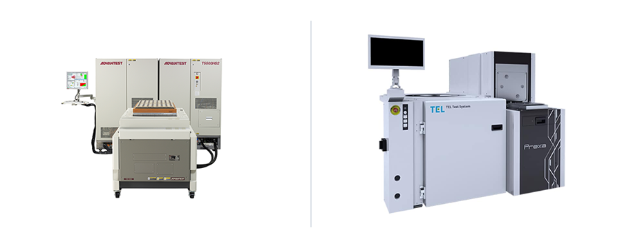
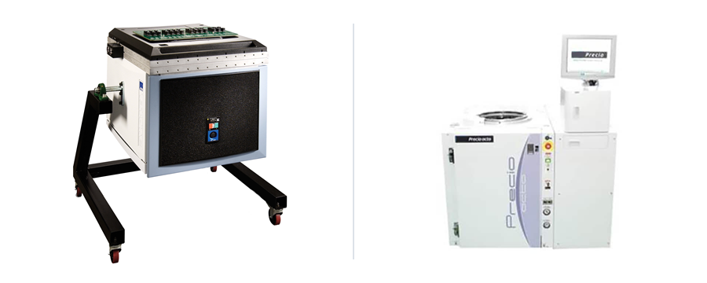
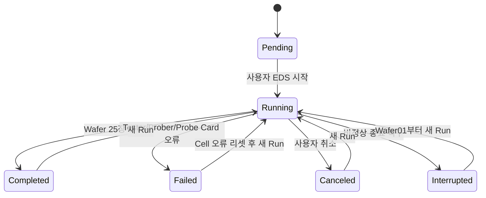

# EDS Wafer Sort Simulator

C# WinForms로 구현한 Fab-out Wafer의 **EDS(Electrical Die Sorting) Lot Job 관리 시뮬레이터**입니다. 고객 의뢰를 Product·Recipe·Test Cell 호환성에 따라 Job으로 구성하고 Wafer01~Wafer25를 순차 시험한 뒤 Final Bin map, 수율, 로그, JSON 체크포인트와 고객용 PDF를 생성합니다.

Burn-in, 실제 Repair, Package Final Test, Module/SLT는 범위에 포함하지 않습니다.

## 포트폴리오에서 보여주는 업무 흐름


- Job은 Memory와 System IC Line을 함께 표현하는 공통 실행 단위입니다.
- Product·Recipe·Test Cell은 Job 생성 시 스냅샷으로 저장합니다.
- Test Cell은 Tester, Wafer Prober, 고정 Probe Card로 구성됩니다.
- Cell 한 대에서는 Run 하나만 실행할 수 있으며 사용 중인 Cell의 대기 Job은 자동 시작하지 않습니다.
- 각 Wafer 완료 시 결과를 체크포인트 저장하고 비정상 종료 Run은 `Interrupted`로 복구합니다.
- Low Yield는 제품 결과이므로 다음 Wafer를 계속 처리하고, Cell 오류는 Run을 즉시 실패 처리합니다.

## 구성한 EDS Line

### Memory Line



- Product: `300 mm LPDDR5X DRAM Wafer`
- Tester: Advantest `T5503HS2`
- Prober: Tokyo Electron `Prexa MS`
- Probe Card: `LPDDR5X 300 mm Full-Wafer Probe Card` (가상 고정 Card)
- Recipe: Load/Contact → Continuity → Memory Cell → Read/Write Pattern → Timing Margin → Die Binning → Unload
- Final Bin: `PASS`, `CONTACT_FAIL`, `CELL_FAIL`, `READ_WRITE_FAIL`, `TIMING_FAIL`

### System IC Line



- Product: `200 mm Automotive Mixed-Signal MCU Wafer`
- Tester: Teradyne `J750Ex-HD`
- Prober: Tokyo Electron `Precio octo`
- Probe Card: `Automotive MCU 200 mm Multi-Site Probe Card` (가상 고정 Card)
- Recipe: Load/Contact → Continuity/DC → Digital/Scan → Embedded Memory → ADC/DAC → Die Binning → Unload
- Final Bin: `PASS`, `CONTACT_DC_FAIL`, `DIGITAL_FAIL`, `EMBEDDED_MEMORY_FAIL`, `MIXED_SIGNAL_FAIL`

## 화면과 조작

### 전체 작업

- 첫 번째 `Job 생성` 카드와 최신순 Job 카드
- 고객명·의뢰번호·Lot ID 통합 검색 및 상태 필터
- Job 상태, 최근 Run, `Low Yield 포함` 배지와 실시간 진행률
- Running Job 더블클릭 시 진행 화면, 종료 Job은 결과 화면으로 이동

### Job 생성과 상세

- 고객명, 고객 의뢰번호, Lot ID, Product, Recipe, Test Cell을 필수 입력
- Product → 허용 Recipe → 연결된 호환 Test Cell 순서로 필터
- 항목이 하나여도 사용자가 직접 확인하고 선택
- Test Cell이 사용 중이어도 Pending Job으로 배정 가능
- 생성 후 Job 정보는 수정하지 않고 새 Run만 추가

### 모의 EDS 결과 설정

- Lot 기본 목표 수율은 98%, 네 실패 Bin 기본 분포는 각각 25%
- Wafer별로 Lot 기본값을 해제해 목표 수율과 대표 실패 Bin을 재정의
- 대표 Bin은 해당 Wafer 실패 die의 60%, 나머지는 Lot 분포에 따라 배정
- Tester·Prober·Probe Card 중 하나와 발생 Wafer·허용 Recipe 단계를 선택해 Run 오류 구성
- 실행 속도는 `1× / 5× / 10× / 20×`, 기본은 `20×`

### 장비 목록

- Test Cell 카드에 Line, Tester, Prober, 연결/유휴/작업/오류 상태와 실시간 진행률 표시
- 상세 화면에서 구성품 상태, 고정 Probe Card, 현재 Job, 최근 Run 확인
- Cell 단위 연결/해제 및 오류 발생 후 수동 `오류 리셋`

### 결과

- `Lot 요약`: Lot 수율, Passed/Low Yield Wafer, PASS/FAIL die, 25장 표, Final Bin Pareto
- `Wafer 상세`: Product die 치수 기반 동적 원형 map, Bin 범례/개수, 선택 die의 Row·Column·Final Bin
- `Test 요약`: Final Bin과 Recipe 단계를 연결한 실패 die/실패율/영향 Wafer 집계
- `로그`: Lot 전체 또는 Wafer별 필터
- 완료 Run만 PDF를 자동 생성하고 Low Yield Wafer map만 부록에 포함

## v3 카탈로그

### Product

```json
{
  "schemaVersion": "3.0",
  "productId": "LPDDR5X-300",
  "family": "Memory",
  "name": "300 mm LPDDR5X DRAM Wafer",
  "waferDiameterMm": 300,
  "material": "Silicon",
  "dieWidthMm": 12.0,
  "dieHeightMm": 8.0,
  "edgeExclusionMm": 3.0,
  "acceptanceYieldPercent": 95.0,
  "allowedRecipeIds": ["LPDDR5X-EDS-PROD"]
}
```

### Recipe

```json
{
  "schemaVersion": "3.0",
  "recipeId": "LPDDR5X-EDS-PROD",
  "productFamily": "Memory",
  "compatibleTestCellIds": ["MEM-CELL-01"],
  "requiredCapabilities": ["LPDDR5X", "300mm", "FullWaferContact", "HighSpeedMemory"],
  "finalBins": [
    { "code": "PASS", "isPass": true, "colorHex": "#27AE60" },
    {
      "code": "CELL_FAIL",
      "isPass": false,
      "relatedStepId": "CELL_TEST",
      "colorHex": "#E74C3C"
    }
  ],
  "steps": [
    {
      "sequence": 3,
      "id": "CELL_TEST",
      "name": "Memory Cell Test",
      "command": "ATE.MARCH_CELL_TEST",
      "durationSeconds": 6,
      "allowedErrorComponents": ["Tester", "ProbeCard"]
    }
  ]
}
```

### Test Cell

```json
{
  "schemaVersion": "3.0",
  "id": "MEM-CELL-01",
  "line": "Memory Line",
  "tester": { "manufacturer": "Advantest", "model": "T5503HS2" },
  "prober": { "manufacturer": "Tokyo Electron", "model": "Prexa MS" },
  "probeCard": {
    "name": "LPDDR5X 300 mm Full-Wafer Probe Card",
    "fixedMounted": true
  },
  "supportedWaferDiametersMm": [300],
  "capabilities": ["LPDDR5X", "300mm", "FullWaferContact", "HighSpeedMemory"]
}
```

v1/v2 광학 검사 문서는 지원하지 않습니다. 잘못된 JSON, 중복 ID, 필수값 누락, Product/Recipe/Cell 관계 또는 capability 불일치는 시작 경고에 파일별로 표시됩니다.

## 결과 생성 규칙

- die 중심이 `wafer radius - edge exclusion` 안에 있을 때만 유효 die입니다.
- 목표 수율과 가장 가까운 정수 PASS die 수를 사용합니다.
- `Run ID + Wafer ID`의 결정적 seed로 실패 die 위치와 Final Bin을 생성합니다.
- Wafer 수율이 Product 기준 95% 이상이면 `Passed`, 미만이면 `LowYield`입니다.
- 완료 Lot 수율은 25장 전체의 `PASS die 합계 / 유효 die 합계`입니다.
- 제품 Final Bin과 Cell 오류는 분리합니다. Cell 오류 Wafer는 `EquipmentError`, 이후 Wafer는 `NotRun`입니다.

## 상태 전이와 복구



- Cell 오류는 Run 종료 후에도 유지되며 장비 상세에서 수동 리셋해야 합니다.
- 사용자 취소와 비정상 종료는 완료된 Wafer 결과를 보존합니다.
- 결과 파일이 없거나 손상돼도 Run 이력을 삭제하지 않고 저장 경로를 보여줍니다.
- Job 삭제는 메타데이터만 삭제하며 `Results` 파일은 보존합니다.

## 저장 구조

실행 데이터는 `%LocalAppData%\RecipeTestProject`에 저장됩니다.

```text
RecipeTestProject/
├─ eds-v3-migration.completed
├─ test-cell-state.json
├─ jobs.json
└─ Results/
   └─ {JobId}/{RunId}/
      ├─ run-result.json
      ├─ run.log
      └─ report.pdf
```

- EDS v3 전환 마커가 없는 최초 실행에서 기존 광학 `jobs.json`과 `Results`를 한 번만 삭제합니다.
- 이후 실행에서는 새 EDS 데이터를 삭제하지 않습니다.
- Job과 Run 체크포인트 JSON은 임시 파일 작성 후 교체합니다.

## 실행과 검증

요구 사항은 Windows와 .NET 10 SDK입니다.

```powershell
dotnet restore
dotnet build RecipeTestProject.slnx
dotnet run --project RecipeTestProject.csproj
dotnet run --project RecipeTestProject.SelfTests/RecipeTestProject.SelfTests.csproj
```

SelfTests는 v3 카탈로그, 호환 필터, 동적 die map, 95% 경계, 균등/대표 Final Bin, 결정적 결과, 25장 완료, 구성품별 오류, 취소, 점유 차단, 체크포인트, 최초 마이그레이션과 PDF 생성을 검증합니다. 예시 보고서는 `output/pdf/sample-eds-lot-report.pdf`에 생성됩니다.

## 기술 구성

- .NET 10 / C# / Windows Forms
- `System.Text.Json`
- `async/await`, `CancellationToken`, `IProgress<T>`
- PDFsharp-MigraDoc-GDI 6.2.4

## 장비 사진·상표 출처

장비 카드는 각 제조사의 공개 제품 사진을 조합해 사용합니다. 사진과 상표의 권리는 각 제조사에 있습니다.

- Advantest T5503HS2: https://www.advantest.com/tw/products/semiconductor-test-system/memory/t5503hs2/
- Teradyne J750Ex-HD: https://www.teradyne.com/products/j750/?lang=en
- Tokyo Electron Prexa MS: https://www.tel.com/product/prexa.html
- Tokyo Electron Precio octo: https://www.tel.com/product/precio.html
