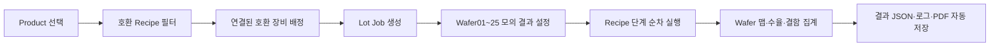

# Wafer Inspect Test Center

C# WinForms로 구현한 **Lot 단위 웨이퍼 검사 Job 관리 시뮬레이터**입니다.  
고객 검사 의뢰를 Product·Recipe·Equipment 호환성에 따라 Job으로 구성하고, 한 Lot의 Wafer 25장을 순차 검사한 뒤 웨이퍼 맵과 수율, 결함 데이터 및 고객용 PDF 보고서를 생성합니다.

## 구현 목적

이 프로젝트는 단순한 장비 실행 UI가 아니라 실제 검사 업무에서 필요한 다음 관심사를 분리해 표현합니다.

- 고객·의뢰번호·Lot 단위 작업 추적
- Product → Recipe → Equipment 호환성 검증
- 장비 연결·점유 상태와 동시 실행 차단
- Recipe 단계 기반 비동기 실행과 취소
- 제품 불량(NG)과 장비 오류의 서로 다른 처리
- Wafer별 체크포인트와 비정상 종료 복구
- Run 이력, 원시 결과 JSON, 로그, PDF 보고서 보존



## 주요 화면

### 전체 작업

- 첫 번째 `Job 생성` 카드와 최신 Job 카드
- 고객명·의뢰번호·Lot ID 검색
- 대기·진행·완료·실패/중단/취소 상태 필터
- 최근 실행, 진행률, NG 포함 여부 표시

### Job 생성 및 상세

- 고객명, 의뢰번호, Lot ID 입력
- `Products` 카탈로그에서 검사 대상 선택
- Product가 허용한 Recipe만 필터링
- Recipe와 호환되고 연결된 장비만 필터링
- Job 생성 후 장비 배정과 Product/Recipe 스냅샷 고정
- 모의 결과 설정, 테스트 시작, 삭제, Run 이력 제공

### Lot 검사

- Wafer01부터 Wafer25까지 순차 실행
- Lot 전체 진행률과 현재 Wafer 표시
- Wafer 25장 상태표, 현재 Recipe 단계, 실시간 로그
- 정상/NG Wafer는 계속 검사
- 장비 오류 발생 시 현재 Run 중단 및 이후 Wafer 미실행 처리

### 결과

- Lot 요약, Wafer 상세, 로그 탭
- 21×21 원형 웨이퍼 맵
- 제품별 합격 수율과 NG 수준별 결정적 결과 생성
- Particle, Scratch, Pattern, Edge, Contamination 결함 분류
- 완료 Run의 고객용 PDF 자동 생성
- 로그와 PDF `다른 이름으로 저장`

자체 검증 실행 시 NG Wafer가 포함된 예시 보고서가 `output/pdf/sample-lot-report.pdf`에 생성됩니다.

## 데이터 카탈로그

### Product v2

```json
{
  "schemaVersion": "2.0",
  "productId": "CIS-X100",
  "name": "CIS-X100 이미지 센서",
  "waferDiameterMm": 300,
  "material": "Silicon",
  "acceptanceYieldPercent": 98.0,
  "allowedRecipeIds": [
    "RCP-WIS3K-STD-001",
    "RCP-WIS5K-HR-004"
  ]
}
```

### Recipe v2

```json
{
  "schemaVersion": "2.0",
  "recipeId": "RCP-WIS3K-STD-001",
  "name": "300 mm 표준 표면 검사",
  "version": "2.0.0",
  "compatibleEquipmentModels": ["WIS-3000"],
  "steps": [
    {
      "sequence": 1,
      "id": "LOAD",
      "name": "웨이퍼 로드",
      "command": "LoadWafer",
      "durationSeconds": 2
    }
  ]
}
```

잘못된 JSON, v1 스키마, 중복 ID, 필수값 누락 문서는 카탈로그에서 제외하고 시작 시 파일별 오류를 표시합니다.

## 상태와 실패 처리

Job 상태는 `Pending`, `Running`, `Completed`, `Failed`, `Canceled`, `Interrupted`로 관리합니다.

- NG: 검사 결과이므로 다음 Wafer를 계속 검사합니다.
- 장비 오류: 지정된 Wafer·Recipe 단계에서 Run을 실패 처리합니다.
- 사용자 취소: 완료된 Wafer 결과를 유지하고 나머지는 미실행 처리합니다.
- 비정상 종료: Wafer별 체크포인트를 읽어 기존 Run을 `Interrupted`로 복구합니다.
- 재실행: 기존 Run을 보존하고 Wafer01부터 새로운 Run을 생성합니다.

장비 하나에는 Run 하나만 실행할 수 있습니다. 사용 중인 장비에도 대기 Job을 배정할 수 있지만 자동 실행하지는 않습니다.

## 저장 구조

실행 데이터는 `%LocalAppData%\RecipeTestProject`에 저장됩니다.

```text
RecipeTestProject/
├─ equipment-state.json
├─ jobs.json
└─ Results/
   └─ {JobId}/
      └─ {RunId}/
         ├─ run-result.json
         ├─ run.log
         └─ report.pdf
```

- `jobs.json`은 임시 파일 작성 후 교체합니다.
- 각 Wafer 완료 시 상세 결과와 로그를 체크포인트 저장합니다.
- Job을 삭제해도 Run 결과 파일은 보존합니다.
- Product와 Recipe는 Job 생성 시 스냅샷으로 저장합니다.

## 실행

요구 사항:

- Windows
- .NET 10 SDK

```powershell
dotnet restore
dotnet run --project RecipeTestProject.csproj
```

처음 실행한 경우 상단 메뉴의 `장비 > 장비 연결`에서 가상 장비를 연결한 뒤 Job을 생성합니다.

## 검증

```powershell
dotnet build RecipeTestProject.slnx
dotnet run --project RecipeTestProject.SelfTests/RecipeTestProject.SelfTests.csproj
```

자체 검증 항목:

- Product/Recipe v2 검증과 참조 무결성
- 21×21 원형 웨이퍼 맵
- 정상 및 NG 수준별 수율·결함 생성
- 동일 Run/Wafer의 결정적 결과 재현
- 25장 순차 완료와 NG 이후 계속 검사
- 장비 오류 즉시 중단
- 취소 시 완료 결과 보존
- Job 원자 저장과 상세 결과 복원
- 한글 PDF 보고서 생성

## 기술 구성

- .NET 10 / C# / Windows Forms
- `System.Text.Json`
- `async/await`, `CancellationToken`, `IProgress<T>`
- PDFsharp + MigraDoc GDI 6.2.4
